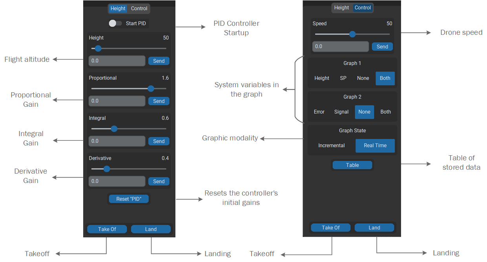
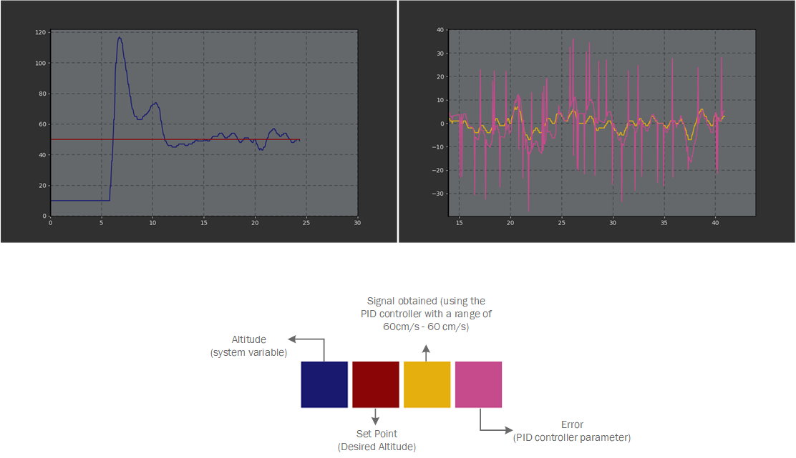
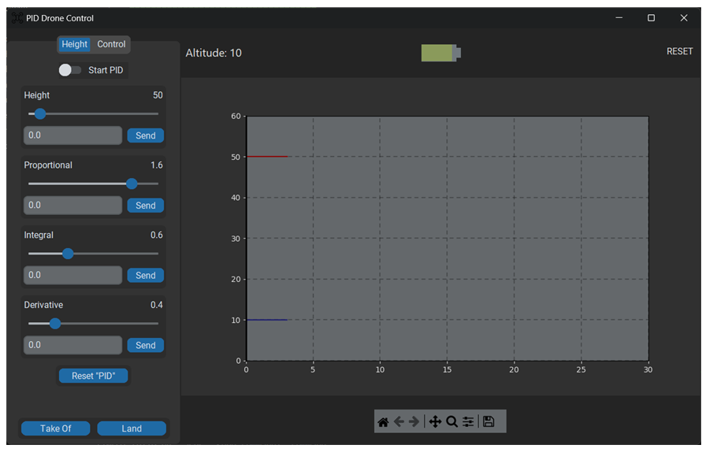

# tello-pid-altitude-control
A Python GUI application for implementing and tuning a PID controller to autonomously stabilize the altitude of a DJI Tello drone.

## Functionality Overview
- **PID Gain Tuning:** Input fields for Proportional, Integral, and Derivative gains to adjust the controller's response in real-time.
- **Setpoint Management:** Set the desired altitude (Set Point) for the drone to maintain.
-  **Flight Control:** Buttons for Takeoff, Landing, and initiating the PID controller.
-  **Data Management:** Controls to select system variables for graphing, switch between real-time and incremental graph modes, and manage the SQLite data table.
> Preview: Gui controls
> 
> 

## Performance Graph
A real-time Matplotlib graph visualizing the PID controller's performance

### Visualized Metrics
- **Altitude (System Variable):** The drone's actual height measured by the sensors.
- **Set Point:** The target altitude you want the drone to achieve and maintain.
- **Error:** The diference between the Set Pint and the actual Altitude, which is the key parameter the PID controller seeks to minimize.
- **Output:** The controller output that will be sent to the aircraft.
> Preview: Graph
> 
> 

## Key Features
- **PID Control Loop:** Automated height stabilization using a custom-tunable PID controller.
- **Real-Time Telemetry Plotting:** Live graph of altitude vs. time using Matplotlib to visualize PID performance.
- **In-Flight PID Tuning:** Adjust P, I, and D gains in real-time without stopping the controller.
- **SQLite Database:** All flight data (altitude, setpoint, PID values) is logged for further analysis.
- **Modern UI:** A clean and intuitive interface built with CustomTkinter.

## Usage
1.  Connect your computer to the Tello's Wi-Fi network.
2.  Run the application:
    ```bash
    python pid_controller_gui.py
    ```
3.  Click `Connect` to start the communication
4.  Set your desired **Altitude** setpoint.
5.  Click `Take Off`  to take off the aircraft.
6.  Click `Start PID` to engage the altitude hold controller.
7.  Use the input fields to adjust the **Proportional**, **Integral**, and **Derivative** gains and observe the changes on the live plot.
8.  Click `Land` to safely finish the flight. All data is automatically saved to the database.

## Data Analysis
Flight data is stored in a local SQLite database file. You can use tools like DB Browser for SQLite or Python scripts to analyze the performance of different PID configurations.

## Windows Preview
> Preview: Gui
> 
> 

## Disclaimer
This project is for educational and experimental purposes. Always fly in a safe, wide-open area away from people, obstacles, and other hazards. The developer is not responsible for any damage or injury caused by the use of this software.
